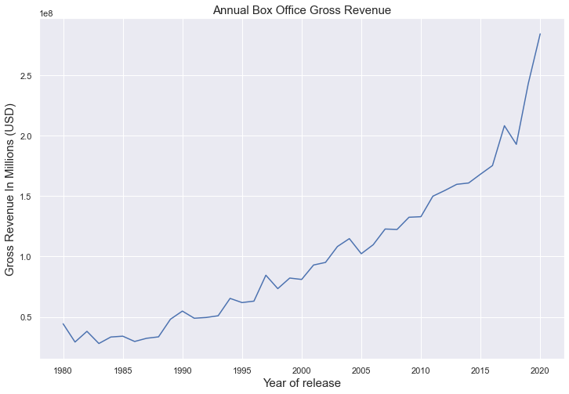
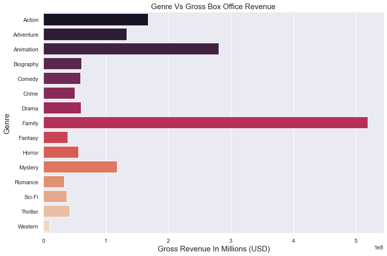
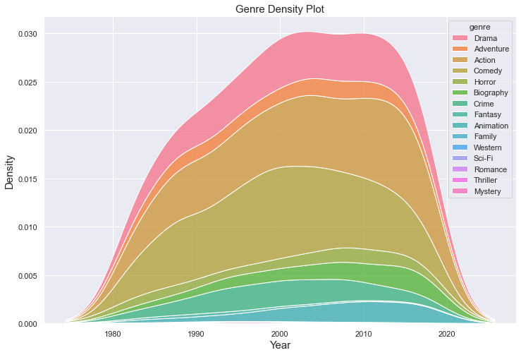
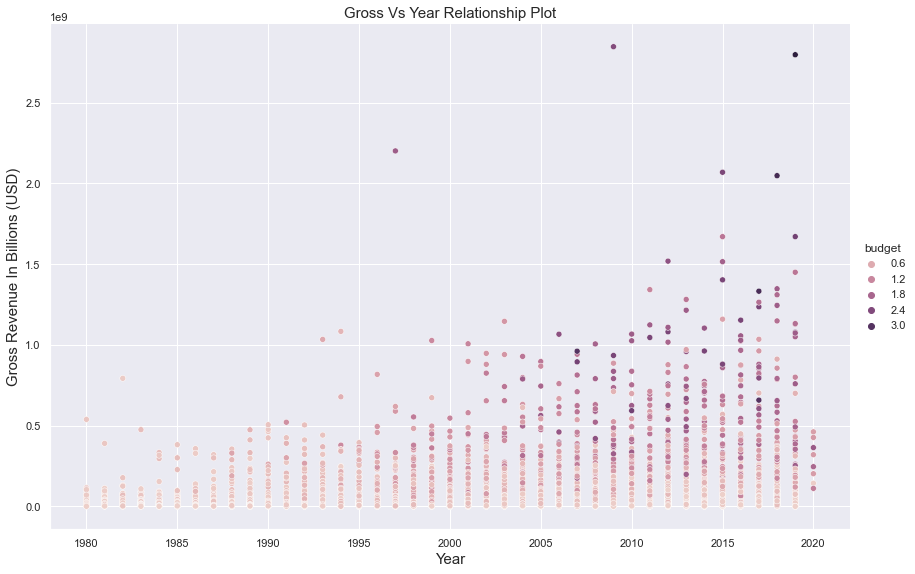
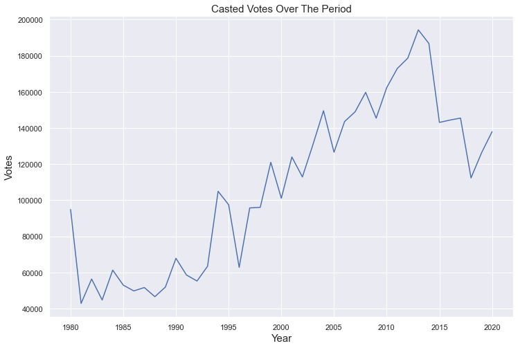

# Movie Industry (Beginning of an End?)

**Authors: Karan Nimmagadda & Walter MIchalski** 

# Introduction

Is the movie business truly coming to an end? notwithstanding the presence of OTT rivals with all of the over-the-top entertainment, many of us wonder if the movie business is on the verge of collapsing. To determine if the business is truly fading or not, we analyzed and visualized data spanning four decades. We imported a data set from Kaggle (https://www.kaggle.com/datasets/danielgrijalvas/movies) with roughly 5400 movies over a 40-year period (1980-2020) and contains the following attributes:

name		: title of the movie

rating		: rating of a film

genre		: genre of the movie

year		: the year movie got released

released	: the date of release (YYYY-MM-DD)

score		: IMDB score

votes		: total number of votes cast

director	: director of the film

writer 		: the film's screenwriter

star		: the film's main actor or actress

country		: country of origin

budget		: budget of the movie

gross		: revenue generated by the movie

company     : production house

runtime		: length of the movie


# Sources

*The data set is from https://www.kaggle.com/datasets/danielgrijalvas/movies

*The data was gathered form IMDB (Internet Movie Data Base)

*The code to create  plots using Seaborn Package

# Explanation of the Code

Our code, movie_industry_health.ipynb , begins by importing all necessary python packages. These include pandas for its ability to create workable dataframes, seaborn for its plotting ability, and matplotlib to save the figures:

Note:The following packages need to be installed:


```python
import pandas as pd
import seaborn as sns
import matplotlib.pyplot as plt
```

*Next, we import the code from the Kaggle website: https://www.kaggle.com.  The data is automatically downloaded and converted to a usable csv file. Then the code will condense the data to remove rows with empty gross revenue/budget cells and displayed to verify the import.

*After that we clean and filter the data by dropping all the NaN rows from the dataset.


```python

#API credentials must be created in order to generate an API token to connect kaggle

from kaggle.api.kaggle_api_extended import KaggleApi

from zipfile import ZipFile

api = KaggleApi()

#Authenticate API requests using the basic authentication with API token

api.authenticate()

api.dataset_download_files('danielgrijalvas/movies')

#Zipfile consisting the dataset is imported from the website 

zf = ZipFile('movies.zip')

#Imported zipfile is extracted to obtain the dataset

zf.extractall()

zf.close()

data=pd.read_csv('movies.csv')

#NaN values are removed from the dataset using dropna() method which returns as a new dataframe

data.dropna(subset=['budget', 'gross'], inplace = True)

data


```


<div>
<style scoped>
    .dataframe tbody tr th:only-of-type {
        vertical-align: middle;
    }

    .dataframe tbody tr th {
        vertical-align: top;
    }

    .dataframe thead th {
        text-align: right;
    }
</style>
<table border="1" class="dataframe">
  <thead>
    <tr style="text-align: right;">
      <th></th>
      <th>name</th>
      <th>rating</th>
      <th>genre</th>
      <th>year</th>
      <th>released</th>
      <th>score</th>
      <th>votes</th>
      <th>director</th>
      <th>writer</th>
      <th>star</th>
      <th>country</th>
      <th>budget</th>
      <th>gross</th>
      <th>company</th>
      <th>runtime</th>
    </tr>
  </thead>
  <tbody>
    <tr>
      <th>0</th>
      <td>The Shining</td>
      <td>R</td>
      <td>Drama</td>
      <td>1980</td>
      <td>June 13, 1980 (United States)</td>
      <td>8.4</td>
      <td>927000.0</td>
      <td>Stanley Kubrick</td>
      <td>Stephen King</td>
      <td>Jack Nicholson</td>
      <td>United Kingdom</td>
      <td>19000000.0</td>
      <td>46998772.0</td>
      <td>Warner Bros.</td>
      <td>146.0</td>
    </tr>
    <tr>
      <th>1</th>
      <td>The Blue Lagoon</td>
      <td>R</td>
      <td>Adventure</td>
      <td>1980</td>
      <td>July 2, 1980 (United States)</td>
      <td>5.8</td>
      <td>65000.0</td>
      <td>Randal Kleiser</td>
      <td>Henry De Vere Stacpoole</td>
      <td>Brooke Shields</td>
      <td>United States</td>
      <td>4500000.0</td>
      <td>58853106.0</td>
      <td>Columbia Pictures</td>
      <td>104.0</td>
    </tr>
    <tr>
      <th>2</th>
      <td>Star Wars: Episode V - The Empire Strikes Back</td>
      <td>PG</td>
      <td>Action</td>
      <td>1980</td>
      <td>June 20, 1980 (United States)</td>
      <td>8.7</td>
      <td>1200000.0</td>
      <td>Irvin Kershner</td>
      <td>Leigh Brackett</td>
      <td>Mark Hamill</td>
      <td>United States</td>
      <td>18000000.0</td>
      <td>538375067.0</td>
      <td>Lucasfilm</td>
      <td>124.0</td>
    </tr>
    <tr>
      <th>3</th>
      <td>Airplane!</td>
      <td>PG</td>
      <td>Comedy</td>
      <td>1980</td>
      <td>July 2, 1980 (United States)</td>
      <td>7.7</td>
      <td>221000.0</td>
      <td>Jim Abrahams</td>
      <td>Jim Abrahams</td>
      <td>Robert Hays</td>
      <td>United States</td>
      <td>3500000.0</td>
      <td>83453539.0</td>
      <td>Paramount Pictures</td>
      <td>88.0</td>
    </tr>
    <tr>
      <th>4</th>
      <td>Caddyshack</td>
      <td>R</td>
      <td>Comedy</td>
      <td>1980</td>
      <td>July 25, 1980 (United States)</td>
      <td>7.3</td>
      <td>108000.0</td>
      <td>Harold Ramis</td>
      <td>Brian Doyle-Murray</td>
      <td>Chevy Chase</td>
      <td>United States</td>
      <td>6000000.0</td>
      <td>39846344.0</td>
      <td>Orion Pictures</td>
      <td>98.0</td>
    </tr>
    <tr>
      <th>...</th>
      <td>...</td>
      <td>...</td>
      <td>...</td>
      <td>...</td>
      <td>...</td>
      <td>...</td>
      <td>...</td>
      <td>...</td>
      <td>...</td>
      <td>...</td>
      <td>...</td>
      <td>...</td>
      <td>...</td>
      <td>...</td>
      <td>...</td>
    </tr>
    <tr>
      <th>7648</th>
      <td>Bad Boys for Life</td>
      <td>R</td>
      <td>Action</td>
      <td>2020</td>
      <td>January 17, 2020 (United States)</td>
      <td>6.6</td>
      <td>140000.0</td>
      <td>Adil El Arbi</td>
      <td>Peter Craig</td>
      <td>Will Smith</td>
      <td>United States</td>
      <td>90000000.0</td>
      <td>426505244.0</td>
      <td>Columbia Pictures</td>
      <td>124.0</td>
    </tr>
    <tr>
      <th>7649</th>
      <td>Sonic the Hedgehog</td>
      <td>PG</td>
      <td>Action</td>
      <td>2020</td>
      <td>February 14, 2020 (United States)</td>
      <td>6.5</td>
      <td>102000.0</td>
      <td>Jeff Fowler</td>
      <td>Pat Casey</td>
      <td>Ben Schwartz</td>
      <td>United States</td>
      <td>85000000.0</td>
      <td>319715683.0</td>
      <td>Paramount Pictures</td>
      <td>99.0</td>
    </tr>
    <tr>
      <th>7650</th>
      <td>Dolittle</td>
      <td>PG</td>
      <td>Adventure</td>
      <td>2020</td>
      <td>January 17, 2020 (United States)</td>
      <td>5.6</td>
      <td>53000.0</td>
      <td>Stephen Gaghan</td>
      <td>Stephen Gaghan</td>
      <td>Robert Downey Jr.</td>
      <td>United States</td>
      <td>175000000.0</td>
      <td>245487753.0</td>
      <td>Universal Pictures</td>
      <td>101.0</td>
    </tr>
    <tr>
      <th>7651</th>
      <td>The Call of the Wild</td>
      <td>PG</td>
      <td>Adventure</td>
      <td>2020</td>
      <td>February 21, 2020 (United States)</td>
      <td>6.8</td>
      <td>42000.0</td>
      <td>Chris Sanders</td>
      <td>Michael Green</td>
      <td>Harrison Ford</td>
      <td>Canada</td>
      <td>135000000.0</td>
      <td>111105497.0</td>
      <td>20th Century Studios</td>
      <td>100.0</td>
    </tr>
    <tr>
      <th>7652</th>
      <td>The Eight Hundred</td>
      <td>Not Rated</td>
      <td>Action</td>
      <td>2020</td>
      <td>August 28, 2020 (United States)</td>
      <td>6.8</td>
      <td>3700.0</td>
      <td>Hu Guan</td>
      <td>Hu Guan</td>
      <td>Zhi-zhong Huang</td>
      <td>China</td>
      <td>80000000.0</td>
      <td>461421559.0</td>
      <td>Beijing Diqi Yinxiang Entertainment</td>
      <td>149.0</td>
    </tr>
  </tbody>
</table>
<p>5436 rows × 15 columns</p>
</div>


# Data Restructuring

Once we have the usable data, the code then takes it to make a couple of useful variables to be used in the creation of our plots.  This includes the average imdb rating for movies during each year, the average gross revenue for movies for each year, the average revenue for each genre, and a list of all genres for indexing.  Pandas was used to keep this data as a dataframe:


```python
#groupby() is used here to group catogories of data

m=data.groupby('year', as_index=False)['score'].mean()
mean_rating=m['score']
imdbavg = data.groupby(['year']).score.mean()
grossavg = data.groupby(['year']).gross.mean()
genrescore = data.groupby(['genre'], as_index=False).score.mean()
genrelist = data['genre'].unique()
votesavg = data.groupby(['year']).votes.mean()
genregross = data.groupby(['genre'], as_index=False).gross.mean()

```

# Data Visualization

Finally, the code is then able to make the plots to visualize the data.  The code writes the accompanying titles and style for the plots in order to make them aesthetically pleasing.  These figures are then saved as .png files:


```python
sns.set_theme(style="darkgrid")
plt.figure(figsize=(12,8))
sns.lineplot(data=grossavg)
plt.title('Annual Box Office Gross Revenue',fontsize=15)
plt.xlabel('Year of release',fontsize=15)
plt.ylabel('Gross Revenue In Millions (USD)',fontsize=15)

```


    

    


A lineplot is used here to visualize the wide form of data.From the plot above we can see that in the first decade is a slight fall of gross revenue and in the next 3 decades rising trend of gross revenue can be clearly seen and in the year 2020 eventhough with maximum OTT competitors, The gross reached all time industry high. One thing to note is that accounting for inflation would still show an increase in the overall revenue over the years as the growth has outpaced inflation over this time period.   


```python
plt.figure(figsize=(12,8))
sns.barplot(data=genregross,x="gross",y="genre",palette='rocket')
plt.savefig('RevPerGenre.png')
plt.title('Genre Vs Gross Box Office Revenue',fontsize=15)
plt.xlabel('Gross Revenue In Millions (USD)',fontsize=15)
plt.ylabel('Genre',fontsize=15)

```


    

    


Then a barplot is visualized to show the relationship between various genres and the gross revenue that each genre had accumulated over the years.  Judging off this graph it seems clear that the biggest two genres that bring in the most money are family movies as well as animated movies.  If this trend continues in the future, a company such as Disney may lead to a serious decline in the box office movie industry as many of their premier titles end up on streaming services like Disney Plus. We can also see the Western genre is mostly dead making very poor revenue commpared to its counterparts.


```python
plt.figure(figsize=(12,8))
sns.kdeplot(data=data, x="year", hue="genre", multiple="stack")
plt.title('Genre Density Plot',fontsize=15)
plt.xlabel('Year',fontsize=15)
plt.ylabel('Density',fontsize=15)

```


    

    


A kernel density estimate (KDE) plot is used to display the distribution of different genres in the dataset. Over the years, the drama, adventure, action, and comedy genres have aided the film business in generating large box office earnings and attracting audiences to the theaters.


```python
plt.figure(figsize=(12,8))
sns.relplot(data=data, x="year", y="gross", hue="budget", kind="scatter",height=8,aspect=1.5)
plt.title('Gross Vs Year Relationship Plot',fontsize=15)
plt.xlabel('Year',fontsize=15)
plt.ylabel('Gross Revenue In Billions (USD)',fontsize=15)

```


    <Figure size 864x576 with 0 Axes>


    

    


The statistical link between the Gross and Budget of each movie evry year is visualized using relational graphs. It helps us to detect trends and patterns in data. Even if there are no competitors in the movie industry, we can observe that a lot of money isn't spent on movies until roughly 2000. The graph clearly demonstrates a surge in movie budgets starting in 2005 in order to compete and entice people to theaters. And certainly, people did turn up to the movies, as seen by the rising trend in gross income. 


```python
plt.figure(figsize=(12,8))
sns.lineplot(data=votesavg)
plt.savefig('IMDBVotesPerYear.png')
plt.title('Casted Votes Over The Period',fontsize=15)
plt.xlabel('Year',fontsize=15)
plt.ylabel('Votes',fontsize=15)

```


    

    


The line plot here shows the average number of IMDB votes counted for a movie over the years.  This depicts a steady increase from 1980 until approximately 2015 in which there then seems to be a rapid decrease.  This might coincide with the prevelance of Netflix and other streaming services gaining popularity during this time which may account for the general public being less interested in the movie market.

# How to Run the Code

1.	Ensure Anaconda package is downloaded.

2.	Open a terminal window and pip install kaggle using the following command:
    


```python
pip install Kaggle
```

    Requirement already satisfied: Kaggle in c:\users\walsk\anaconda3\lib\site-packages (1.5.12)
    Requirement already satisfied: certifi in c:\users\walsk\anaconda3\lib\site-packages (from Kaggle) (2021.10.8)
    Requirement already satisfied: requests in c:\users\walsk\anaconda3\lib\site-packages (from Kaggle) (2.26.0)
    Requirement already satisfied: urllib3 in c:\users\walsk\anaconda3\lib\site-packages (from Kaggle) (1.26.7)
    Requirement already satisfied: six>=1.10 in c:\users\walsk\anaconda3\lib\site-packages (from Kaggle) (1.16.0)
    Requirement already satisfied: python-dateutil in c:\users\walsk\anaconda3\lib\site-packages (from Kaggle) (2.8.2)
    Requirement already satisfied: python-slugify in c:\users\walsk\anaconda3\lib\site-packages (from Kaggle) (5.0.2)
    Requirement already satisfied: tqdm in c:\users\walsk\anaconda3\lib\site-packages (from Kaggle) (4.62.3)
    Requirement already satisfied: text-unidecode>=1.3 in c:\users\walsk\anaconda3\lib\site-packages (from python-slugify->Kaggle) (1.3)
    Requirement already satisfied: idna<4,>=2.5 in c:\users\walsk\anaconda3\lib\site-packages (from requests->Kaggle) (3.2)
    Requirement already satisfied: charset-normalizer~=2.0.0 in c:\users\walsk\anaconda3\lib\site-packages (from requests->Kaggle) (2.0.4)
    Requirement already satisfied: colorama in c:\users\walsk\anaconda3\lib\site-packages (from tqdm->Kaggle) (0.4.4)
    Note: you may need to restart the kernel to use updated packages.
    

3.	Create an API Token on the kaggle website (you may need to create a free account) and place the file in the following directory on your device:

    (C:\Users\YOURUSERNAME\.kaggle)

*note if the .kaggle folder is not automatically created, one can be manually created

4.	Open Jupyter Notebook.

5.	Navigate to where this code is saved on your device.

6.	Run the code


# Suggestions

Other features and figures can be created for a variety of different applications using this data.  For example, if someone did not want to talk about the industry as a whole and instead wanted to focus on a specific genre’s figures, they could use that with only slight modifications of the code.  This could show how well some genres have grown compared to others or even help determine which genres the direction in which those genres are trending.  Similarly, one could also focus on specific ratings given to movies to determine whether or not maturity ratings have different growths or declines in popularity.  Another interesting possibility is that of seeing the impact of certain directors or lead actors/actresses on the gross revenue of a movie to see which stars bring in the most money and people to theatres.  


```python

```
